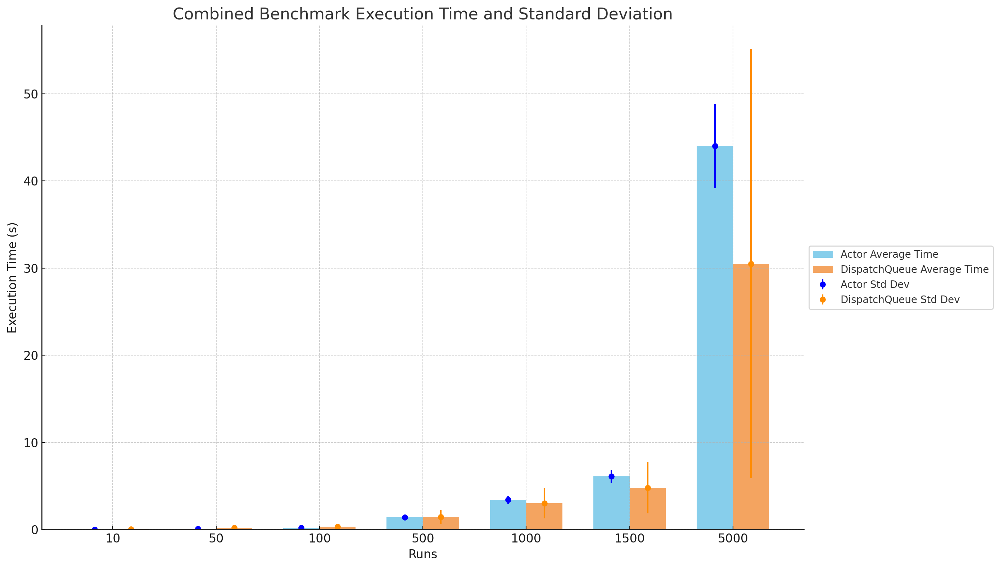

<script type="text/javascript">
        function googleTranslateElementInit() {
            new google.translate.TranslateElement({
                pageLanguage: 'auto',
                layout: google.translate.TranslateElement.InlineLayout.VERTICAL,
                autoDisplay: true
            }, 'google_translate_element');
        }
</script>
<script type="text/javascript" src="//translate.google.com/translate_a/element.js?cb=googleTranslateElementInit"></script>
<link rel="stylesheet" href="https://fonts.googleapis.com/css?family=Bungee Hairline&display=swap">

<div style="display: flex; justify-content: center;">
  
</div>

# Exploring Concurrency in Swift: Actors vs. Queues

Concurrent programming in Swift has been a hot topic, especially since the introduction of *actors*. This new player in the concurrency game has sparked debates about its performance vis-à-vis the traditional *queues*. To get a clearer picture, I rolled up my sleeves and benchmarked these two approaches.

## What Are Actors?
An *actor* in Swift serves as a guardian of its mutable state, ensuring single-threaded access to prevent the dreaded data races. It's a heavyweight champion of thread safety in the concurrent programming ring.

### The Significance of Actors in Swift Concurrency

*Actors* are not just a new feature; they're a paradigm shift. By locking down state access and integrating with Swift's *async/await*, they reduce the mental gymnastics required to maintain thread safety. They represent a move towards more predictable and maintainable concurrency in Swift.

## Understanding the Limits of Actors in Preventing Data Races

As [Antoine van der Lee points out](https://www.avanderlee.com/swift/actors/#why-data-races-can-still-occur-when-using-actors), actors aren't a silver bullet. They mitigate, not eliminate, the risk of data races. It's a bit like wearing a seatbelt—it makes you safer, but it's not an excuse for reckless driving.

### Why Data Races Can Still Occur When Using Actors

Even with actors, the sequence of asynchronous operations can still lead to races, albeit of a different kind. It's not about simultaneous access, but about the timing and order of operations, which still demands developer vigilance.

```swift
queueOne.async {
    await feeder.chickenStartsEating()
}
queueTwo.async {
    print(await feeder.numberOfEatingChickens)
}
```

The crux of the matter is that actors shift the nature of race conditions. They offer a controlled environment, but it's on the developers to steer clear of timing pitfalls.

## Benchmarking

### Setup
To put this to the test, I created a scenario with *actors* and *DispatchQueue*, timing their operations involving a mock temperature logger.

[Actor Playground Implementation](ActorTemperatureLogger.playground/Contents.swift)

[DispatchQueue Playground Implementation](DispatchQueueTemperatureLogger.playground/Contents.swift)

### Results
I crunched the numbers, and here's the data:

| Runs | Component     | Average Execution Time (seconds) | Median Execution Time (seconds) | Standard Deviation of Execution Time (seconds) | Total Measurements | Notes |
|------|---------------|----------------------------------|---------------------------------|-------------------------------------------------|--------------------|-------|
| 10   | Actor         | 0.0263634085                     | 0.0302392705                    | 0.008733507339838242                           | 30                 |       |
| 10   | DispatchQueue | 0.038884270799999995             | 0.039969020999999993            | 0.003318502673248548                           | 30                 |       |
| 50   | Actor         | 0.09523081010000002              | 0.10296445800000001             | 0.023547593880998936                           | 150                |       |
| 50   | DispatchQueue | 0.19973209494                     | 0.214760354                     | 0.028667415804254786                           | 150                |       |
| 100  | Actor         | 0.21355324090000008              | 0.2293904585                    | 0.04365364316586947                            | 300                |       |
| 100  | DispatchQueue | 0.3505280370599999               | 0.308498854                     | 0.11525222904532295                            | 300                |       |
| 500  | Actor         | 1.41273607833                    | 1.46941725                      | 0.20757241215870095                            | 1500               |       |
| 500  | DispatchQueue | 1.4593390492419998               | 1.5291020835000002              | 0.7816940446783845                             | 1500               |       |
| 1000 | Actor         | 3.432818794544995                | 3.536968458                     | 0.44535471787905123                            | 3000               |       |
| 1000 | DispatchQueue | 3.0110555153670027               | 2.8920404165                    | 1.7202161787585477                             | 3000               | **     |
| 1500 | Actor         | 6.104391908370001                | 6.263336729500001               | 0.7372806404140805                             | 4500               |       |
| 1500 | DispatchQueue | 4.780818677598665                | 4.3577189165                    | 2.9351269876076653                             | 4500               | **     |
| 5000 | Actor         | 43.99566643877493                | 44.907944833                    | 4.778725795415856                              | 15000              |       |
| 5000 | DispatchQueue | 30.483703210767132               | 24.319241333                    | 24.598807693444005                             | 15000              | **    |

** Noteworthy: Multiple errors during queue runs—malloc double frees, out-of-range indices, a clear signal of the fragility of queues under stress.

* Tested on: Apple M2 Max - 64GB RAM



The graph shows a trend: actors offer more consistent performance, while queues show variability under load.

### Benchmark Observations and Stability vs. Performance
At 5000 interactions, we see a trade-off: dispatch queues are faster but less stable than actors. For mission-critical applications where predictability is key, actors may be the go-to despite a performance hit.

### Discussing Actor Synchronization
Synchronization in actors, involving mailboxes or message passing, can add overhead. Future benchmarks might probe these mechanisms under high contention.

## Analysis
Actors and queues are both competent, but actors provide an edge in maintenance and cognitive load. Still, benchmark findings are contextual, and one size does not fit all.

## Conclusion
Incorporating Swift's actors can be a boon for thread safety and data integrity, but the choice between actors and queues should hinge on project-specific requirements. Performance is just one piece of the puzzle—clarity and maintainability are equally crucial.

As Swift's concurrency evolves, staying updated is not optional; it's crucial for Swift developers who aspire to build resilient, powerful, and efficient applications.

## Reference to Swift's Actor Proposal
For a deep dive into actors in Swift, [Swift Evolution proposal SE-0306](https://github.com/apple/swift-evolution/blob/main/proposals/0306-actors.md) is your go-to resource.