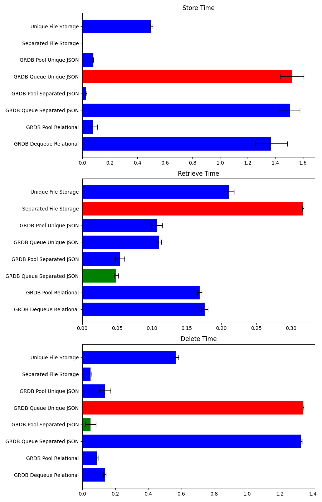

<link rel="stylesheet" href="https://fonts.googleapis.com/css?family=Bungee Hairline&display=swap">

# Exploring Data Storage Performance on AppleTV with Swift

In modern Swift development, efficiently managing data is crucial for building responsive and reliable applications. This article delves into a comprehensive benchmarking study that evaluates the performance of various data storage methods in Swift, aiming to provide developers with insights into selecting the best storage solution for their needs.

## Introduction

In the realm of Swift development, the choice of data storage method plays a pivotal role in determining an application's performance, reliability, and overall user experience. With a plethora of storage options available, ranging from file-based solutions to sophisticated database systems, developers are often faced with the challenge of selecting the most suitable storage mechanism for their specific needs. Efficient data storage and retrieval mechanisms are crucial for ensuring smooth and responsive app behavior, especially for applications that handle a significant amount of data or require high-speed data access for real-time functionalities.

The goal of this benchmarking study is to empirically compare the performance of various data storage methods available to Swift developers, specifically within the context of Swift programming language and Apple's ecosystem. By focusing on key operations such as data storage, retrieval, and deletion, this study aims to provide a comprehensive performance analysis that can serve as a guide for developers in making informed decisions when architecting their Swift applications. Conducted on an AppleTV HD and iPhone 12 Pro, this benchmark offers insights into how different storage solutions perform under identical conditions, thereby highlighting their strengths and weaknesses in real-world scenarios. Through this analysis, developers will gain a better understanding of which storage methods best align with their application requirements, optimizing for speed, efficiency, and reliability.

## Methodology

The methodology of this benchmarking study was meticulously designed to ensure a fair and comprehensive comparison of various data storage methods accessible to Swift developers. While the study's findings are derived from tests conducted on an AppleTV HD and iPhone 12 Pro, the insights gained are broadly applicable to Swift development across Apple's platforms, providing valuable guidance for developers regardless of their specific target device.

### Test Environment

The benchmark tests were executed on an AppleTV HD and iPhone 12 Pro, chosen for its consistent performance characteristics and relevance as a development platform. The device was running the latest available operating system at the time of testing, ensuring that the results reflect the performance of storage methods under current development conditions. This environment provides a solid foundation for evaluating the storage methods' efficiency, reliability, and scalability.

### Benchmark Criteria

The core of the benchmarking process focused on three critical operations that are fundamental to data management:

1. **Store**: Measuring the time taken to save or write data to the storage medium.
2. **Retrieve**: Assessing the efficiency of querying or accessing stored data.
3. **Delete**: Evaluating the speed and effectiveness of removing data from storage.

These operations were selected as key indicators of a storage method's performance, directly impacting the user experience and application's responsiveness.

### Execution Process

At the heart of the benchmark execution was a custom `ViewController` implemented specifically for this study. This `ViewController` served as the orchestrator for initiating the benchmark tests, ensuring that each storage method was subjected to identical conditions for a fair comparison. The setup involved:

- Preparing a set of data models to be stored, retrieved, and deleted across multiple iterations, to average out any anomalies and provide a more accurate representation of performance.
- Implementing a systematic approach to execute the store, retrieve, and delete operations sequentially for each storage method, with a brief pause between each operation to minimize potential interference.
- Recording the time taken for each operation, allowing for a detailed analysis of each storage method's performance.

This structured approach to benchmarking, combined with the controlled test environment, ensures that the results offer meaningful insights into the performance characteristics of each storage method in a Swift development context.

## Storage Methods Under Test

- **Separated File Storage**: Explains the concept and its typical use cases.
- **Unique File Storage**: Dives into its unique attributes and when it's advantageous to use it.
- **GRDB Storage Variants**: Introduces GRDB and its configurations used in the test (Dequeue, Pool, JSON storage, etc.), focusing on how they handle data operations differently.

## Why GRDB.swift?

In the landscape of Swift development, [GRDB.swift](https://github.com/groue/GRDB.swift?tab=readme-ov-file) emerges as a distinguished library for data persistence, primarily due to its adept handling of SQLite databases. Tailored specifically for Swift, GRDB.swift marries the simplicity and power of SQLite with Swift's modern syntax and features, offering developers a type-safe, performant, and straightforward way to manage local databases. Its comprehensive support for concurrency ensures that data operations do not hinder the user experience, making it an ideal choice for applications that demand both responsiveness and robust data management. Additionally, GRDB.swift's ORM capabilities streamline the process of translating between database rows and Swift objects, facilitating more intuitive and less error-prone data handling. With its active development and strong community support, GRDB.swift stands out not just for its technical merits but also for the wealth of knowledge and resources available to developers. This combination of features makes GRDB.swift a compelling choice for Swift developers seeking a reliable, efficient, and Swift-centric database solution.

## Benchmarking Process

- Details the process followed in the `benchmark` function within the `ViewController`, including:
    - Number of iterations and models tested.
    - The wait time between operations and its significance.
    - Initialization and configuration of each storage method.

## Results and Analysis

### Apple TV HD

In the benchmarking scenario, each storage method was subjected to 10 iterations of storing, retrieving, and deleting 30 models on an AppleTV HD. This rigorous testing environment was designed to mimic realistic application usage patterns, providing a solid basis for evaluating the performance of each storage strategy under consistent conditions.

The results of the benchmarking tests revealed significant performance differences between the storage methods. Here's a detailed analysis:

- **Store Time**: *GRDB Pool Separated JSON Storage* emerged as the fastest method for data storage, significantly outperforming other methods with its minimal average time. This superior performance can be attributed to its efficient handling of JSON data and the use of a connection pool, which optimizes database access times.

- **Retrieve Time**: For data retrieval, *GRDB Queue Separated JSON Storage* stood out, showcasing its strength in quickly accessing stored JSON objects. The specialized JSON storage mechanism and serialized access pattern likely contributed to its top-tier performance in this category.

- **Delete Time**: Again, *GRDB Pool Separated JSON Storage* proved to be the most efficient, indicating that its approach to managing JSON data and leveraging a connection pool is equally effective for deletion operations.

These findings underscore the impact of storage method choice on application performance. The superior performance of GRDB-based storage methods, particularly those optimized for JSON, highlights their potential benefits for Swift applications requiring efficient data handling. The use of connection pools and queues in these methods effectively manages database access and concurrency, contributing to their high performance.

Furthermore, the significant performance gap between these methods and traditional file-based storage solutions illustrates the advantages of database-oriented storage in scenarios requiring rapid data manipulation. This analysis suggests that for applications developed in Swift, especially those running on platforms like AppleTV HD, selecting a storage method that aligns with the data access and management patterns of the application can lead to substantial performance improvements.

### iPhone 12 Pro

In this benchmarking scenario, we evaluated the performance of various storage methods by conducting 10 iterations of storing, retrieving, and deleting 30 models on an iPhone 12 Pro. This device was selected for its advanced hardware capabilities and widespread use among consumers, offering a relevant and contemporary context for assessing the storage strategies' effectiveness.

The testing revealed notable differences in how each storage method performed, with some clearly outpacing others in efficiency:

- **Store Time**: The *GRDB Pool Separated JSON Storage* method demonstrated exceptional speed, making it the quickest option for storing data. This performance advantage is likely due to its proficient handling of JSON data coupled with the utilization of a connection pool, facilitating faster database interactions.

- **Retrieve Time**: When it came to retrieving data, *GRDB Queue Separated JSON Storage* proved superior. Its ability to swiftly access stored JSON objects can be attributed to its specialized storage mechanism and the serial processing of access requests, which ensures prompt data retrieval.

- **Delete Time**: Consistently, *GRDB Pool Separated JSON Storage* also led the field in deletion efficiency. This indicates that its approach to JSON data management and connection pooling is not only beneficial for storing data but also for its deletion, underscoring the method's overall efficiency and versatility.

These results emphasize the critical role of choosing the right storage method in enhancing app performance. The standout performance of GRDB-based storage solutions, especially those tailored for JSON handling, showcases their potential in applications that demand fast and efficient data processing. The implementation of connection pools and serialized access significantly contributes to their effectiveness, offering a clear pathway to performance optimization.

Moreover, the comparison highlights the distinct advantages of database-oriented storage solutions over traditional file-based methods in scenarios that necessitate quick data manipulation. This analysis, grounded in the testing on an iPhone 12 Pro, suggests that adopting storage solutions that align with an application's data access and management requirements can significantly boost performance, providing a smoother and more responsive user experience.

## Storage Implementations

A brief overview of each storage implementation based on the provided Swift files:

- **GRDBQueueStorage**: Utilizes GRDB with a queue for serial database access.
- **GRDBQueueJsonStorage**: Focuses on storing JSON objects in a GRDB-managed database using a queue.
- **GRDBQueueUniqueJsonStorage**: Aims at storing unique JSON objects, preventing duplicates.
- **GRDBPoolStorage**: Employs a connection pool for concurrent database access.
- **GRDBPoolJsonStorage**: Handles JSON objects with a connection pool, optimizing for concurrency.
- **GRDBPoolUniqueJsonStorage**: Stores unique JSON objects using a connection pool for efficient access.
- **SeparatedFileStorage**: Stores data in separate files on the filesystem.
- **UniqueFileStorage**: Ensures the uniqueness of files stored on the filesystem.

## Conclusion

The comprehensive benchmarking study presented in this article underscores the pivotal role of data storage method selection in optimizing Swift application performance. Through meticulous testing on both the AppleTV HD and iPhone 12 Pro, the study illuminated the significant performance disparities among various storage options, with GRDB-based solutions, particularly those optimized for JSON storage, demonstrating superior efficiency in data handling operations.

The findings highlight the importance of considering the specific data management needs of an application when selecting a storage method. For Swift developers, this means prioritizing storage solutions that not only provide fast and efficient data access but also align with the application's overall architecture and performance goals. The standout efficiency of GRDB Pool Separated JSON Storage and GRDB Queue Separated JSON Storage, for example, showcases the benefits of leveraging database-oriented storage solutions over traditional file-based methods, especially in scenarios requiring rapid and frequent data manipulation.

Moreover, the study's results advocate for the adoption of storage methods that effectively manage database access and concurrency, such as those utilizing connection pools and queues. These strategies not only enhance data processing speed but also contribute to a smoother and more responsive user experience, ultimately benefiting both developers and end-users.

In conclusion, this benchmarking study serves as a valuable resource for Swift developers navigating the complex landscape of data storage options. By providing empirical evidence of the performance capabilities of various storage methods, it empowers developers to make informed decisions that bolster the efficiency, reliability, and overall quality of their Swift applications.

### Datasource for download
[PoC-DB.zip](PoC-DB.zip)